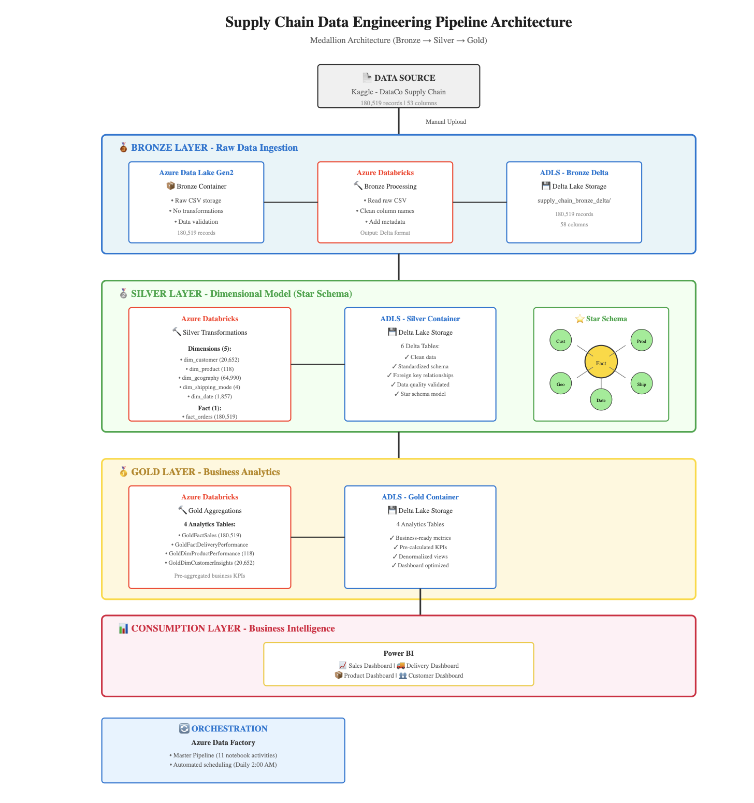
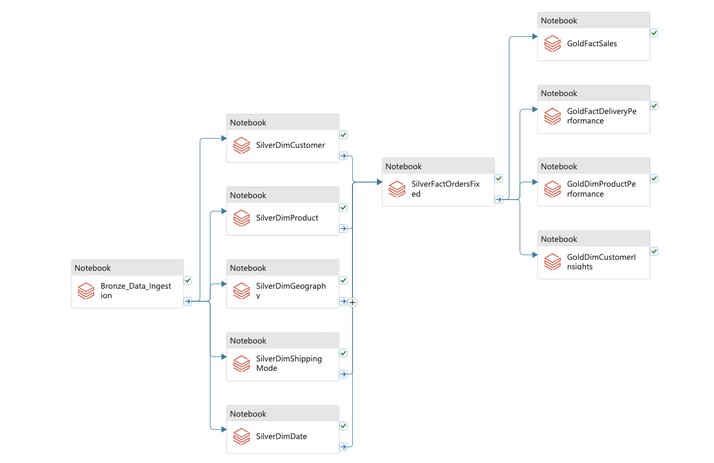
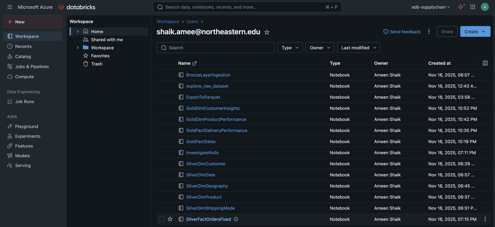

# Supply Chain Data Engineering Pipeline

---

## Project Overview

An end-to-end cloud-based data engineering pipeline built on Microsoft Azure that processes e-commerce supply chain data through a Medallion Architecture (Bronze-Silver-Gold layers). The pipeline automates data ingestion, transformation, and analytics preparation, delivering actionable business insights through interactive dashboards.

### Key Achievements
- ✅ Processed **180,519 order records** across **53 data attributes**
- ✅ Built automated ETL pipeline with **zero manual intervention**
- ✅ Created **star schema** with 5 dimensions and 1 fact table
- ✅ Generated **4 business-ready analytics tables**
- ✅ Delivered insights on **$36.78M** in revenue and **20,652 customers**

---

## Dataset

**Source:** [DataCo Smart Supply Chain for Big Data Analysis](https://www.kaggle.com/datasets/shashwatwork/dataco-smart-supply-chain-for-big-data-analysis)

**Description:**
- **Records:** 180,519 order transactions
- **Attributes:** 53 columns including sales, customer demographics, product details, and shipping logistics
- **Time Period:** January 2015 - January 2018
- **Geographic Coverage:** Global (multiple countries and markets)
- **Business Domains:** Orders, customers, products, shipping, and delivery

**Key Features:**
- Order and shipping dates
- Customer information (segment, location)
- Product details (category, price)
- Delivery status and performance
- Sales and profitability metrics

---

## Architecture



### Medallion Architecture Design

The pipeline implements a three-layer Medallion Architecture for progressive data refinement:

#### **Bronze Layer - Raw Data**
- **Purpose:** Store raw, unprocessed data exactly as received from source
- **Storage:** Azure Data Lake Storage Gen2 (ADLS)
- **Format:** Delta Lake
- **Processing:** Databricks notebook (`BronzeLayerIngestion`)
- **Output:** 180,519 records with metadata columns
- **Characteristics:**
  - No transformations applied
  - Column names standardized (removed special characters)
  - Audit columns added (ingestion timestamp, source file, pipeline run ID)

#### **Silver Layer - Dimensional Model**
- **Purpose:** Create clean, validated, business-ready dimensional model
- **Storage:** Azure Data Lake Storage Gen2
- **Format:** Delta Lake
- **Data Model:** Star Schema

**Dimension Tables (5):**
1. `dim_customer` - 20,652 unique customers
2. `dim_product` - 118 unique products with category/department hierarchy
3. `dim_geography` - 64,990 location combinations (city, state, country, region, market)
4. `dim_shipping_mode` - 4 shipping methods
5. `dim_date` - 1,857 dates with calendar attributes (2014-2018)

**Fact Table (1):**
6. `fact_orders` - 180,519 order line items with foreign keys to all dimensions

**Processing:** 6 Databricks notebooks for transformation and validation

**Characteristics:**
- Data quality validated (no null foreign keys)
- Surrogate keys generated for geography and shipping mode
- Cleaned and standardized data types
- Deduplication applied
- Referential integrity enforced

#### **Gold Layer - Business Analytics**
- **Purpose:** Pre-aggregated, analytics-ready business intelligence tables
- **Storage:** Azure Data Lake Storage Gen2
- **Format:** Delta Lake

**Analytics Tables (4):**

1. **GoldFactSales** (180,519 records)
   - Comprehensive sales analytics across all dimensions
   - Calculated metrics: profit margins, discount impact, revenue analysis
   - Dimensions: date, product, customer, geography, shipping

2. **GoldFactDeliveryPerformance** (180,519 records)
   - Shipping and delivery performance metrics
   - Late delivery analysis and severity classification
   - Performance scoring and trend analysis
   - Dimensions: time, geography, shipping mode, customer segment

3. **GoldDimProductPerformance** (118 products)
   - Product-level profitability and sales metrics
   - Category and department aggregations
   - Product rankings and performance ratings
   - Metrics: revenue per unit, profit per unit, sales velocity

4. **GoldDimCustomerInsights** (20,652 customers)
   - Customer lifetime value (CLV) analysis
   - RFM segmentation (Recency, Frequency, Monetary)
   - Customer health status and retention metrics
   - Purchase behavior patterns

---

## Technology Stack

| Category | Technology | Purpose |
|----------|------------|---------|
| **Data Storage** | Azure Data Lake Storage Gen2 (ADLS) | Centralized data lake for all layers |
| **Data Processing** | Azure Databricks (PySpark) | Data transformation and analytics |
| **Data Format** | Delta Lake | ACID transactions, versioning, schema evolution |
| **Orchestration** | Azure Data Factory (ADF) | Pipeline automation and scheduling |
| **Visualization** | Power BI | Interactive dashboards and reporting |
| **Version Control** | GitHub | Code repository and collaboration |
| **Language** | Python (PySpark) | Data processing and transformations |

---

## Pipeline Automation



### Azure Data Factory Pipeline

**Pipeline Name:** `pl_supply_chain_master`

**Components:**
- **11 Databricks notebook activities** orchestrated in proper sequence
- **Dependency management** ensures correct execution order
- **Parallel execution** where possible (dimensions, gold tables)
- **Error handling** with activity-level success/failure paths

**Execution Flow:**
```
Bronze Ingestion
    ↓
5 Silver Dimensions (parallel)
    ↓
Silver Fact Table
    ↓
4 Gold Analytics Tables (parallel)
```

**Automation:**
- **Schedule Trigger:** Daily execution at 2:00 AM
- **Manual Trigger:** On-demand execution for testing
- **Monitoring:** Pipeline run history and alerts

**Total Pipeline Runtime:** ~10-12 minutes end-to-end

---

## Implementation



### Databricks Notebooks (11 total)

**Bronze Layer (1):**
- `BronzeLayerIngestion.py` - Raw data ingestion with metadata

**Silver Layer - Dimensions (5):**
- `SilverDimCustomer.py` - Customer dimension
- `SilverDimProduct.py` - Product dimension with category hierarchy
- `SilverDimGeography.py` - Geographic dimension with surrogate keys
- `SilverDimShippingMode.py` - Shipping method dimension
- `SilverDimDate.py` - Calendar dimension table

**Silver Layer - Fact (1):**
- `SilverFactOrdersFixed.py` - Order fact table with all foreign keys

**Gold Layer (4):**
- `GoldFactSales.py` - Sales analytics
- `GoldFactDeliveryPerformance.py` - Delivery metrics
- `GoldDimProductPerformance.py` - Product profitability
- `GoldDimCustomerInsights.py` - Customer segmentation

---

## Business Intelligence


### Power BI Dashboards

**Dashboards Created:**
1. **Sales Performance Dashboard**
   - Total revenue and profit metrics
   - Sales trends over time
   - Category and market analysis
   - Top product performance

2. **Delivery Performance Dashboard** (optional)
   - On-time delivery rates
   - Shipping mode efficiency
   - Geographic delivery analysis

3. **Customer & Product Insights** (optional)
   - Customer segmentation
   - Product profitability matrix
   - Top customers and products

**Connection:** Direct connection to Gold layer via Azure Data Lake Storage Gen2

---

## Key Business Insights

### Overall Performance
- **Total Revenue:** $36.78 Million
- **Total Profit:** $3.97 Million
- **Average Profit Margin:** 10.8%
- **Total Orders:** 180,519
- **Total Items Sold:** 384,079

### Critical Findings

#### Delivery Performance Issues
- **Late Delivery Rate:** 54.83% (98,977 orders)
- **On-Time Delivery:** Only 45.17%
- **Major Issue:** First Class shipping has only 4.7% on-time rate despite being premium service
- **Best Performer:** Standard Class with 61.9% on-time rate
- **Recommendation:** Urgent investigation needed for First Class and Second Class shipping

#### Top Performing Products
1. **Field & Stream Gun Safe** - $6.93M (19% of total revenue)
2. **Perfect Fitness Perfect Rip Deck** - $4.42M
3. **Diamondback Women's Bike** - $4.12M

#### Unprofitable Products
- **3 products losing money:**
  - SOLE E35 Elliptical: -$965 loss
  - Bushnell Rangefinder: -$256 loss
  - SOLE E25 Elliptical: -$170 loss
- **Recommendation:** Discontinue or reprice these products

#### Market Performance
1. **Europe:** $10.87M (30% of revenue)
2. **LATAM:** $10.28M (28% of revenue)
3. **Pacific Asia:** $8.27M (22% of revenue)

#### 👥 Customer Insights
- **Repeat Customers:** 57% of customer base generates 92% of revenue
- **Average Customer Lifetime Value:** $1,781
- **Top Customer Segment:** Potential Loyalists (5,252 customers, $12.9M total CLV)
- **Customer Concentration:** 62% from USA, 38% from Puerto Rico

---

## How to Run the Pipeline

### Prerequisites
1. Azure subscription with required permissions
2. Azure Data Lake Storage Gen2 account
3. Azure Databricks workspace
4. Azure Data Factory instance
5. Dataset downloaded from Kaggle

### Setup Instructions

#### 1. Configure Azure Resources
```bash
# Resource Group
Resource Group: rg-supplychain-de
Region: East US

# Storage Account
Name: adlssupplychainproject
Type: ADLS Gen2 (hierarchical namespace enabled)
Containers: bronze, silver, gold

# Databricks Workspace
Name: dbw-supplychain
Tier: Premium

# Data Factory
Name: adf-supplychain-pipeline
```

#### 2. Configure Databricks Connection
```python
storage_account_name = "adlssupplychainproject"
storage_account_key = "<YOUR_STORAGE_ACCOUNT_KEY>"

spark.conf.set(
    f"fs.azure.account.key.{storage_account_name}.dfs.core.windows.net",
    storage_account_key
)
```

**Security Note:** Use Azure Key Vault or Databricks Secrets in production instead of hardcoding credentials.

#### 3. Upload Dataset
- Upload `DataCoSupplyChainDataset.csv` to Bronze container

#### 4. Import Notebooks
- Import all notebooks from `notebooks/` folder to Databricks workspace
- Maintain folder structure: bronze/, silver/, gold/

#### 5. Configure ADF Pipeline
- Create Databricks linked service
- Import pipeline: `pl_supply_chain_master`
- Configure notebook paths to match your workspace
- Set up schedule trigger (optional)

#### 6. Execute Pipeline
```
Option 1: Manual trigger
- Go to ADF → Pipeline → Add trigger → Trigger now

Option 2: Automated schedule
- Pipeline runs daily at 2:00 AM automatically
```

### Expected Results
- **Bronze:** 180,519 records in Delta format
- **Silver:** 6 tables (5 dimensions + 1 fact)
- **Gold:** 4 analytics tables
- **Duration:** ~10-12 minutes

---

## Repository Structure
```
supplychainpipeline/
├── README.md                          # Project documentation
├── .gitignore                         # Git ignore rules
├── data/
│   └── DataCoSupplyChainDataset.csv   # Source dataset
├── notebooks/
│   ├── Bronze/
│   │   └── BronzeLayerIngestion.py
│   ├── SilverLayer/
│   │   ├── SilverDimCustomer.py
│   │   ├── SilverDimProduct.py
│   │   ├── SilverDimGeography.py
│   │   ├── SilverDimShippingMode.py
│   │   ├── SilverDimDate.py
│   │   └── SilverFactOrdersFixed.py
│   ├── GoldLayer/
│   │   ├── GoldFactSales.py
│   │   ├── GoldFactDeliveryPerformance.py
│   │   ├── GoldDimProductPerformance.py
│   │   └── GoldDimCustomerInsights.py
│   └── Utils/
│       ├── explore_raw_dataset.py
│       └── ExportToParquet.py
├── images/
│   ├── architecture-diagram.png
│   ├── adf-pipeline-flow.png
│   ├── databricks-workspace.png
│   └── powerbi-sales-dashboard.png
└── reports/
    └── Iteration-4.pdf
```

---

## Screenshots

### Architecture Overview

*Complete data pipeline architecture showing Bronze-Silver-Gold medallion layers*

### Azure Data Factory Pipeline

*Automated orchestration pipeline with 11 Databricks notebook activities*

### Databricks Workspace

*Organized notebook structure for Bronze, Silver, and Gold layer processing*

### Power BI Dashboard

*Sales performance dashboard with key business metrics and trends*

---

## Learning Outcomes

Through this project, I gained hands-on experience with:

### Technical Skills
- ✅ Designing and implementing **Medallion Architecture** (Bronze-Silver-Gold)
- ✅ Building **star schema** dimensional models for analytics
- ✅ Writing **PySpark transformations** in Azure Databricks
- ✅ Creating **Delta Lake tables** with ACID transactions
- ✅ Orchestrating **end-to-end pipelines** with Azure Data Factory
- ✅ Implementing **automated scheduling** and dependency management
- ✅ Connecting **Power BI to cloud data sources**
- ✅ Managing **version control** with Git and GitHub

### Data Engineering Concepts
- ✅ ETL/ELT pipeline design patterns
- ✅ Data quality validation and cleansing
- ✅ Dimensional modeling (facts and dimensions)
- ✅ Surrogate key generation
- ✅ Incremental data processing
- ✅ Cloud-native architecture design
- ✅ Data lake vs data warehouse concepts

### Business Intelligence
- ✅ Translating business questions into data models
- ✅ Creating meaningful KPIs and metrics
- ✅ RFM analysis for customer segmentation
- ✅ Profitability analysis and margin calculations
- ✅ Operational metrics (delivery performance)

---

## Data Quality & Validation

### Data Quality Checks Implemented
- ✅ **Null validation:** Zero null values in all primary and foreign keys
- ✅ **Duplicate detection:** Removed duplicate records in dimension tables
- ✅ **Referential integrity:** All foreign keys validated against dimension tables
- ✅ **Date parsing:** Proper timestamp conversion (M/d/yyyy H:mm format)
- ✅ **Geography matching:** 100% geography join success after optimization
- ✅ **Data type validation:** Proper decimal formatting for financial fields

### Issues Resolved
- **Geography Null Issue:** Initial join had 155,679 null geography_ids (9.25%) due to null zipcodes
  - **Solution:** Modified join to exclude zipcode, reduced nulls to 0
- **Column Name Issues:** Delta Lake rejected special characters in column names
  - **Solution:** Implemented column name cleaning function (removed spaces, parentheses)
- **Date Format:** Inconsistent date formats caused parsing errors
  - **Solution:** Used PySpark to_timestamp with proper format pattern

---

## Business Recommendations

Based on the data analysis, here are key actionable recommendations:

### 1. Fix Delivery Operations (HIGH PRIORITY)
- **Problem:** 54.83% late delivery rate is unacceptable
- **Root Cause:** First Class (4.7% on-time) and Second Class (23.4% on-time) severely underperforming
- **Action:** 
  - Investigate First Class shipping process immediately
  - Learn from Standard Class (61.9% on-time rate)
  - Implement process improvements in underperforming modes

### 2. Optimize Product Portfolio
- **Action:** Discontinue or reprice 3 unprofitable products (SOLE elliptical machines)
- **Opportunity:** Expand top performers (Gun Safe, Perfect Rip Deck)
- **Focus:** Invest more in Fishing category ($6.93M, highest performing)

### 3. Improve Customer Retention
- **Insight:** Repeat customers (57% of base) drive 92% of revenue
- **Action:** 
  - Implement loyalty programs targeting "Potential Loyalists" segment
  - Focus on converting one-time buyers (43% of customers)
  - Re-engagement campaigns for churned customers

### 4. Geographic Expansion
- **Insight:** Europe and LATAM are top markets (~30% each)
- **Opportunity:** Investigate growth potential in underperforming regions
- **Action:** Targeted delivery improvements in low-performing countries (Ecuador, Mozambique)

---

## Technical Implementation Details

### Delta Lake Benefits
- **ACID Transactions:** Ensures data consistency during concurrent reads/writes
- **Schema Evolution:** Easily adapt to changing data structures
- **Time Travel:** Query historical versions of data
- **Optimized Performance:** Efficient querying with data skipping and Z-ordering

### Pipeline Design Patterns
- **Idempotent Operations:** Safe to re-run without duplicating data
- **Incremental Processing:** Bronze layer uses append mode for new data
- **Parallel Execution:** Dimension tables process simultaneously for efficiency
- **Fail-Safe Design:** Each layer can be reprocessed independently

### Performance Optimizations
- **Partitioning:** Delta tables partitioned for optimal query performance
- **Coalesce:** Single file per Gold table for Power BI efficiency
- **Caching:** Strategic use of .cache() for frequently accessed data
- **Broadcast Joins:** Small dimension tables broadcasted for faster joins

---

## Data Model

### Star Schema Design

**Fact Table:**
- `fact_orders` - Grain: One row per order line item
- **Foreign Keys:** Links to all 5 dimensions
- **Measures:** Sales, profit, quantity, discounts, shipping days

**Dimension Tables:**
- `dim_customer` - Customer attributes and segmentation
- `dim_product` - Product hierarchy (Department → Category → Product)
- `dim_geography` - Location hierarchy (Market → Country → State → City)
- `dim_shipping_mode` - Shipping methods and scheduled days
- `dim_date` - Calendar with fiscal attributes

**Design Principles:**
- Slowly Changing Dimensions (SCD) Type 1 (current values only)
- Surrogate keys for geography and shipping mode
- Natural keys preserved for traceability
- Conformed dimensions across all fact tables

---

## Security & Best Practices

### Security Measures
- ✅ Access keys stored securely (not in code repository)
- ✅ `.gitignore` configured to prevent credential exposure
- ✅ Azure Key Vault integration recommended for production
- ✅ Databricks Secrets for credential management
- ✅ SSH authentication for GitHub

### Best Practices Implemented
- ✅ Environment-specific configuration (dev, prod separation ready)
- ✅ Comprehensive error handling and logging
- ✅ Metadata columns for audit trail
- ✅ Parameterized pipelines for reusability
- ✅ Version control for all code artifacts
- ✅ Documentation and code comments

---

## Challenges & Solutions

### Challenge 1: Geography Dimension Matching
- **Issue:** 9.25% of orders had null geography_id due to null zipcodes
- **Solution:** Modified join strategy to exclude zipcode, achieving 100% match rate
- **Learning:** Understand data quality before building joins

### Challenge 2: Delta Lake Column Names
- **Issue:** Special characters in column names rejected by Delta Lake
- **Solution:** Created cleaning function to standardize column names
- **Learning:** Different storage formats have different constraints

### Challenge 3: ADF Databricks Authentication
- **Issue:** Connection setup required proper cluster configuration
- **Solution:** Used existing interactive cluster with access token authentication
- **Learning:** Cloud service integration requires careful configuration

---

## References & Resources

### Azure Documentation
- [Azure Data Lake Storage Gen2](https://learn.microsoft.com/en-us/azure/storage/blobs/data-lake-storage-introduction)
- [Azure Databricks](https://learn.microsoft.com/en-us/azure/databricks/)
- [Azure Data Factory](https://learn.microsoft.com/en-us/azure/data-factory/)
- [Delta Lake](https://docs.delta.io/latest/index.html)

### Project Resources
- [Dataset Source](https://www.kaggle.com/datasets/shashwatwork/dataco-smart-supply-chain-for-big-data-analysis)
- [Reference Project](https://github.com/rithujaa/ecom-data-pipeline)

---

## Project Deliverables

- ✅ Fully functional cloud data pipeline
- ✅ Medallion architecture implementation (Bronze-Silver-Gold)
- ✅ Star schema dimensional model
- ✅ Automated orchestration with ADF
- ✅ Business intelligence dashboards
- ✅ Comprehensive documentation
- ✅ Version-controlled codebase
- ✅ Actionable business insights

---

## Contact

**Ameen Shaik**  
Email: shaik.amee@northeastern.edu 
GitHub: [@ameenshaik](https://github.com/ameenshaik)  
LinkedIn: [Connect with me](www.linkedin.com/in/ameen-shaik-945681183)

---

## License

This project is submitted for academic evaluation as part of DS 5110 coursework at Northeastern University, Fall 2025.

---

## Acknowledgments

- **Course:** DS 5110 - Introduction to Data Management and Processing
- **Institution:** Northeastern University
- **Dataset:** DataCo Global Supply Chain Dataset (Kaggle)